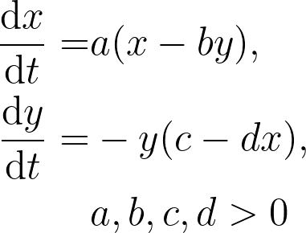
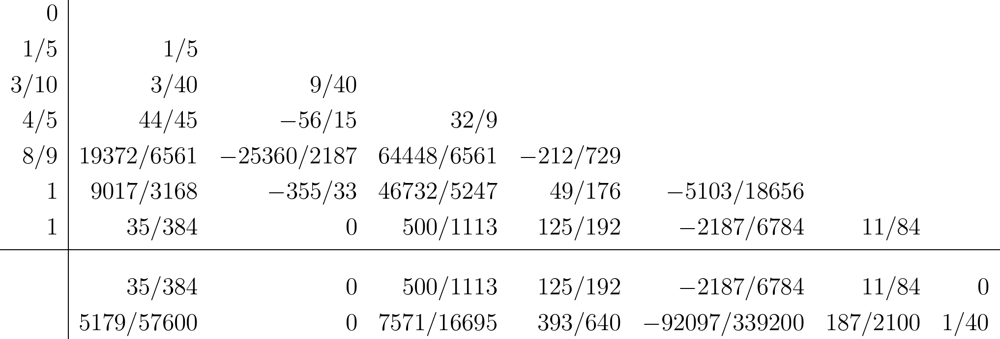
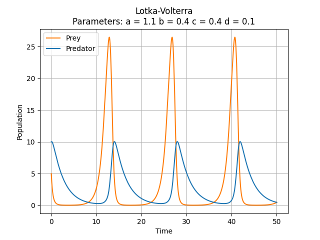
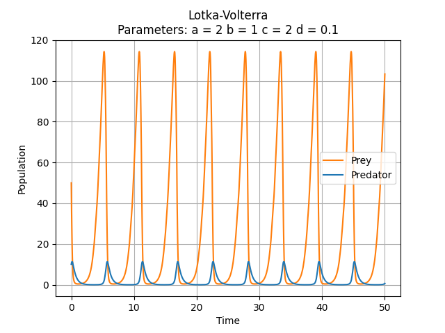
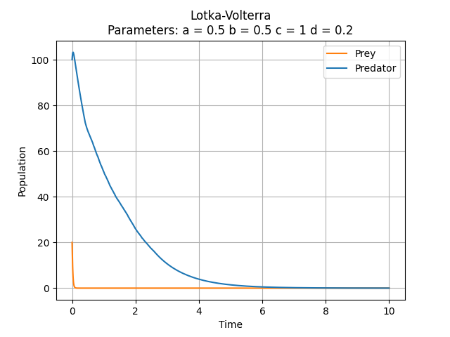

## Lotka Volterra Equations

The Lotka Volterra Equations model the growth of prey and some predator as a system of first-order differential equations. 



Here ```x``` is the number of prey and ```y``` the number of some predator.
```a,b,c,d``` are parameters which influence growth rates.

## Dormand-Prince-45 Method

The Dormand-Prince-45 method is an embedded Runge-Kutta method for solving first order differential equations with initial values. With this method you will get two different approximations for the next time step, calculated with a 4th and 5th order method, which are then compared to determine the size of the next time step. If the difference is too big you might want to do the same calculations for a smaller time step to undercut a set tolerance for the truncation error. This is called an adaptive step size control. The coefficients for this embedded method are noted in the following table:



## Examples

Obviously there are diverse outcomes for different parameters and here are some examples:






